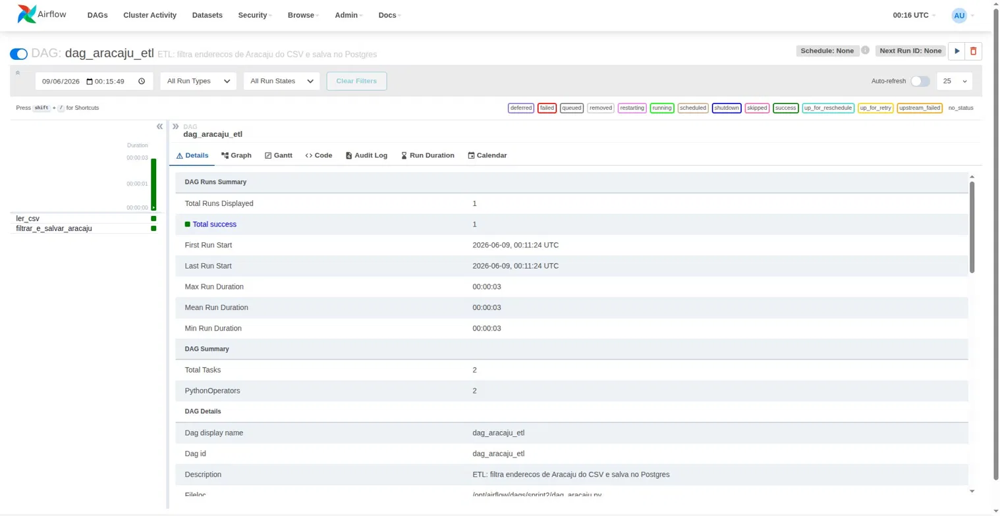
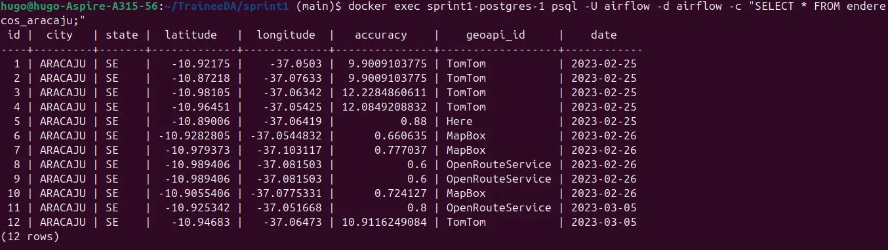

# Sprint 2 — Introdução ao Airflow e primeiros DAGs

## Objetivo
Aprender como o Airflow agenda e orquestra tarefas (DAGs), criando um pipeline ETL que lê um CSV, filtra registros de Aracaju e salva no PostgreSQL.

## Estrutura
sprint2/
├── dags/
│   └── dag_aracaju.py
├── data/
│   └── dados_processo_seletivo.csv
├── assets/
│   ├── airflow_dag_sucesso.png
│   └── postgres_resultado.png
└── README.md

## Como rodar

O ambiente Docker deve estar rodando a partir da sprint1:

```bash
cd ../sprint1
docker compose up -d
```

Acesse o Airflow em http://localhost:8080 (usuário: admin, senha: admin), localize a DAG dag_aracaju_etl e dispare manualmente clicando no botão play.

## O que a DAG faz

O pipeline é composto por 2 tarefas executadas em sequência:

**Tarefa 1 — ler_csv**
Lê o arquivo dados_processo_seletivo.csv com 50.000 registros e exibe no log o total de linhas e colunas.

**Tarefa 2 — filtrar_e_salvar_aracaju**
Filtra apenas os registros onde city == ARACAJU e salva na tabela enderecos_aracaju do PostgreSQL.

Fluxo: [ler_csv] → [filtrar_e_salvar_aracaju]

## Resultados

### DAG executada com sucesso no Airflow


### 12 registros de Aracaju salvos no PostgreSQL


## Tecnologias utilizadas
- Apache Airflow 2.9.1
- PostgreSQL 15
- Python (pandas, psycopg2)
- Docker Compose
