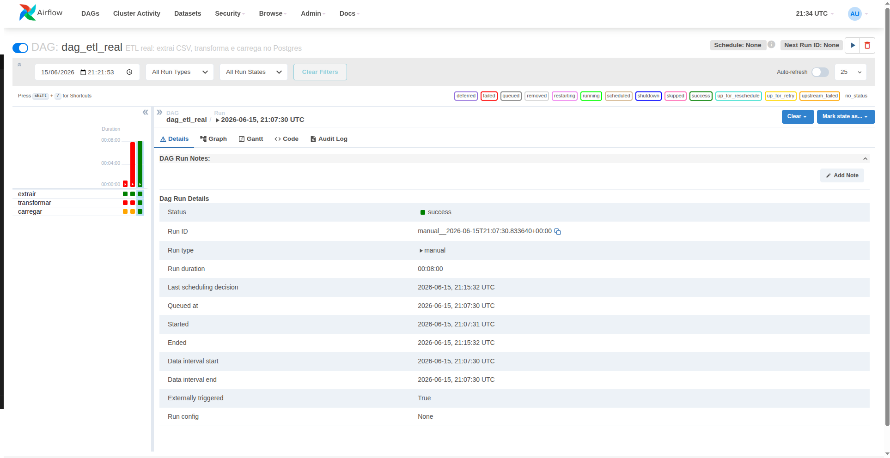
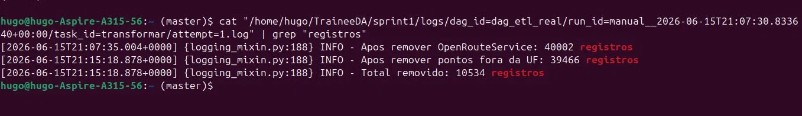
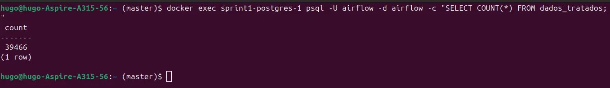

# Sprint 3 - ETL Real com Shapefile IBGE

## Objetivo
Construir um pipeline ETL real com transformacoes geograficas, removendo dados inconsistentes e salvando os dados tratados no PostgreSQL.

## Estrutura
- dags/dag_etl_real.py - DAG com pipeline ETL completo
- data/dados_processo_seletivo.csv - CSV original com 50.000 registros
- data/BR_UF_2022.zip - Shapefile oficial dos estados do IBGE
- data/dados_tratados.csv - Resultado do ETL
- assets/ - Prints de evidencia da execucao

## Como rodar

O ambiente Docker deve estar rodando a partir da sprint1:

    cd ../sprint1
    docker compose up -d

Acesse o Airflow em http://localhost:8080 (usuario: admin, senha: admin),
localize a DAG dag_etl_real e dispare manualmente clicando no botao play.

## Pipeline ETL

O pipeline e composto por 3 tarefas em sequencia:

    [extrair] -> [transformar] -> [carregar]

### Extracao
Le o arquivo dados_processo_seletivo.csv com 50.000 registros e converte para DataFrame pandas.

### Transformacao
Aplica duas regras de limpeza:

1. Remove registros geocodificados pelo OpenRouteService
2. Usa o shapefile oficial do IBGE (BR_UF_2022) para verificar se cada ponto
   (latitude/longitude) esta dentro do poligono do estado declarado.
   Pontos fora da UF sao removidos.

### Carga
Salva os dados tratados na tabela dados_tratados do PostgreSQL.

## Resultados

### DAG executada com sucesso - 3 tarefas concluidas

### Detalhes da transformacao

- 50.000 registros extraidos do CSV
- 40.002 apos remover OpenRouteService (9.998 removidos)
- 39.466 apos remover pontos fora da UF (536 removidos)
- Total removido: 10.534 registros

### 39.466 registros salvos no PostgreSQL

## Tecnologias utilizadas
- Apache Airflow 2.9.1
- PostgreSQL 15
- Python (pandas, geopandas, psycopg2, shapely)
- Shapefile IBGE BR_UF_2022
- Docker Compose