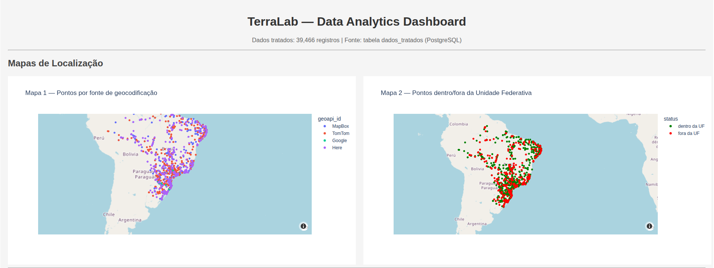
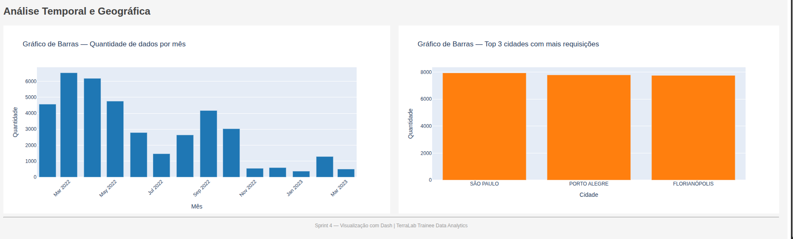

# Sprint 5 — Visualização com Dash

## Objetivo
Criar um dashboard interativo com Dash conectado ao PostgreSQL, exibindo mapas e gráficos dos dados tratados na Sprint 3.

## Estrutura
- app.py — aplicação Dash com os 4 elementos visuais
- Dockerfile — contêiner do app Dash
- requirements.txt — dependências Python
- assets/ — prints de evidência da execução

## Como rodar

O ambiente Docker deve estar rodando a partir da sprint1:

    cd ../sprint1
    docker compose up -d

Acesse o dashboard em http://localhost:8050

## Elementos do Dashboard

### Mapa 1 — Pontos por fonte de geocodificação
Exibe todos os 39.466 registros no mapa, coloridos por geoapi_id (MapBox, TomTom, Google, Here).

### Mapa 2 — Pontos dentro/fora da Unidade Federativa
Exibe os pontos com cores verde (dentro da UF) e vermelho (fora da UF).

### Gráfico de Barras — Quantidade de dados por mês
Distribuição temporal dos registros de Mar/2022 a Mar/2023.

### Gráfico de Barras — Top 3 cidades com mais requisições
1. São Paulo
2. Porto Alegre
3. Florianópolis

## Evidências

### Mapas de localização

### Gráficos de análise

## Tecnologias utilizadas
- Python Dash 2.17.1
- Plotly 5.22.0
- pandas 2.2.2
- psycopg2 / SQLAlchemy
- PostgreSQL 15
- Docker